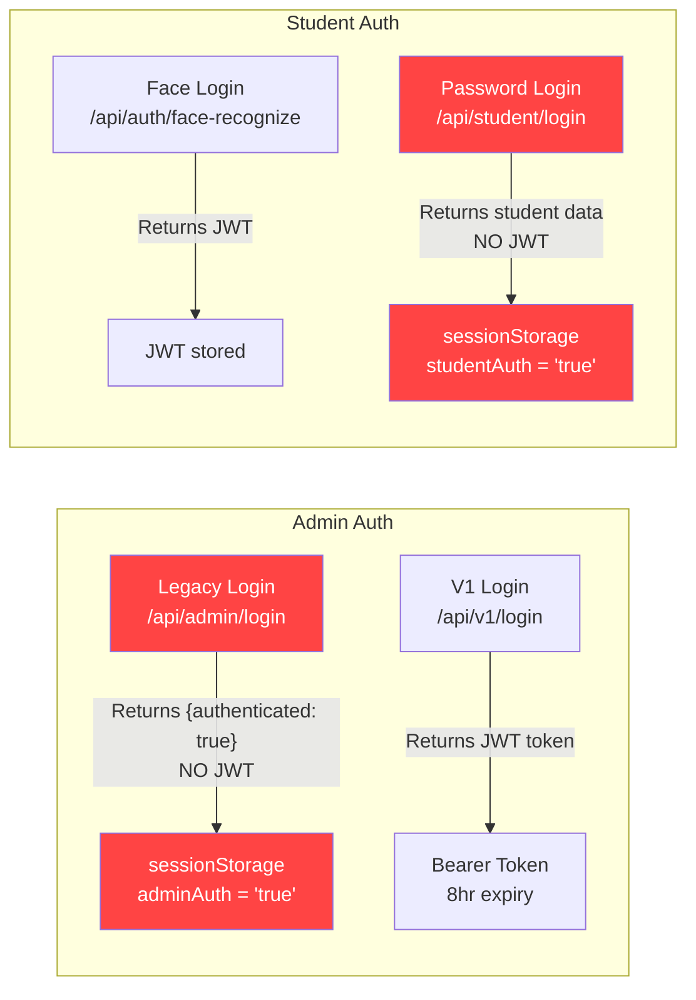
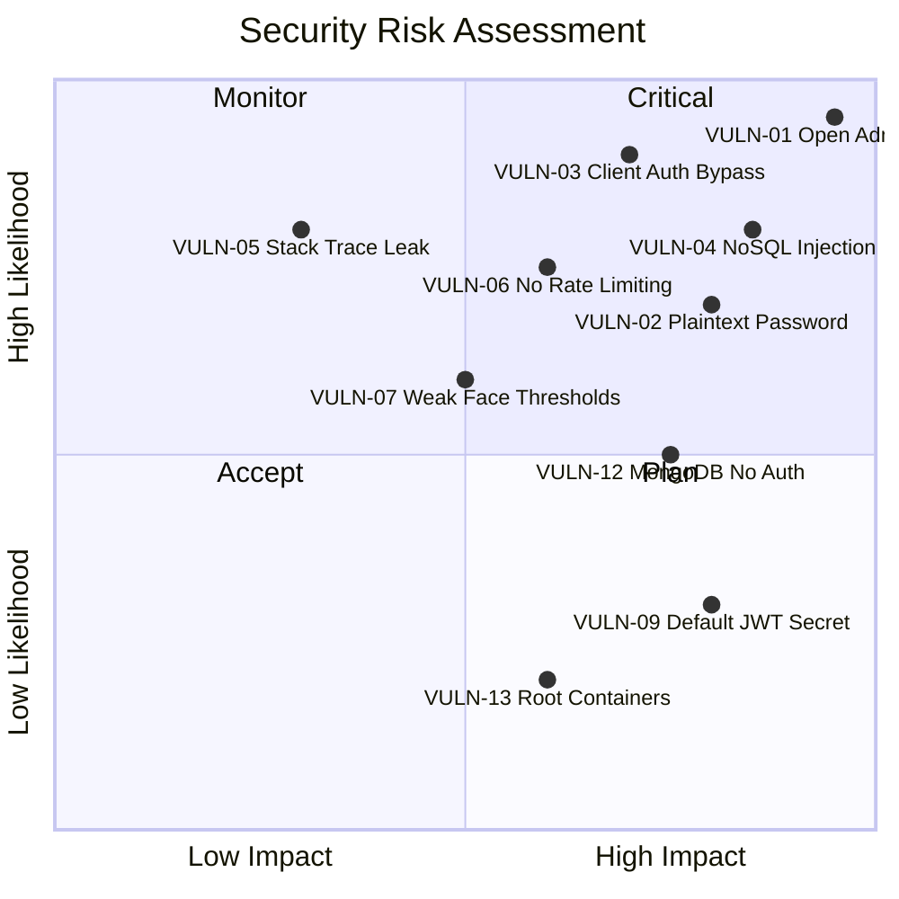

# 🔒 Security Audit Report — MindKraft (Vox) Exam Platform

**Date:** 2026-03-25  
**Auditor:** Automated Security Analysis  
**Scope:** Full-stack application — React frontend, FastAPI backend, MongoDB, Docker infrastructure  
**Version Audited:** v2.0.0 (pre-hardening)

---

## Table of Contents
1. [Executive Summary](#executive-summary)
2. [Application Architecture](#application-architecture)
3. [Vulnerability Assessment — Before Hardening](#vulnerability-assessment--before-hardening)
4. [XSS Analysis](#xss-analysis)
5. [CSRF Analysis](#csrf-analysis)
6. [Injection Analysis](#injection-analysis)
7. [Authentication & Authorization](#authentication--authorization)
8. [Data Protection](#data-protection)
9. [Infrastructure & Docker](#infrastructure--docker)
10. [Security Headers](#security-headers)
11. [Remediation Plan — After Hardening](#remediation-plan--after-hardening)
12. [Risk Matrix](#risk-matrix)

---

## Executive Summary

The MindKraft (Vox) exam platform was subjected to a comprehensive security audit covering OWASP Top 10 categories. **18 vulnerabilities** were identified across 5 severity levels.

| Severity | Count | Key Findings |
|----------|-------|-------------|
| 🔴 Critical | 5 | Unprotected admin APIs, plaintext password fallback, NoSQL injection |
| 🟠 High | 5 | No rate limiting, weak face auth thresholds, no MongoDB auth |
| 🟡 Medium | 4 | Stack trace leakage, no CSP, no request size limits |
| 🔵 Low | 3 | Default JWT secret, Docker runs as root, missing HSTS |
| ⚪ Info | 1 | No CSRF tokens (mitigated by Bearer auth pattern) |

**Overall Risk Rating: HIGH** — The application has critical authentication bypass vulnerabilities that allow unauthenticated access to all admin functionality.

---

## Application Architecture

```
Browser → Nginx (:4100) → FastAPI Backend (:3000) → MongoDB (:27017)
                ↕                    ↕
         face-api.js          Whisper STT / espeak TTS
         (client-side)              Ollama LLM
```

| Component | Technology | Security-Relevant |
|-----------|-----------|-------------------|
| Frontend | React 18 + Vite | Auto-escapes JSX (XSS-safe), uses `face-api.js` |
| Backend | Python FastAPI | JWT (HS256), bcrypt, raw dict request bodies |
| Database | MongoDB 7 | No authentication configured |
| Proxy | Nginx | Reverse proxy, static serving |
| Auth | JWT Bearer tokens | 8-hour expiry, HS256 signing |

---

## Vulnerability Assessment — Before Hardening

### VULN-01: Unauthenticated Admin API Access
| Field | Value |
|-------|-------|
| **Severity** | 🔴 Critical |
| **CVSS** | 9.8 |
| **OWASP** | A01:2021 – Broken Access Control |
| **Location** | `app/main.py` — 13 `/api/admin/*` endpoints |
| **Status** | ❌ VULNERABLE |

**Description:** All legacy `/api/admin/*` endpoints (create/delete exams, view submissions, modify scores, register faces) have **zero authentication middleware**. Any anonymous user can perform all admin operations.

**Proof of Concept:**
```bash
# List all exams without any authentication
curl http://localhost:4000/api/admin/exams
# Response: {"success": true, "data": [...all exams...]}

# Delete an exam without authentication
curl -X DELETE http://localhost:4000/api/admin/exam/CS301
# Response: {"success": true}
```

**Affected Endpoints:**
- `GET /api/admin/exams`
- `POST /api/admin/create-exam`
- `POST /api/admin/upload-exam-pdf`
- `POST /api/admin/publish-exam`
- `POST /api/admin/unpublish-exam`
- `DELETE /api/admin/exam/{code}`
- `PUT /api/admin/exam/{code}`
- `POST /api/admin/register-student-face`
- `GET /api/admin/dashboard/stats`
- `GET /api/admin/activity`
- `GET /api/admin/submissions`
- `GET /api/admin/students-for-scoring`
- `POST /api/admin/score`
- `GET /api/admin/answers/{id}` + `/download`

---

### VULN-02: Plaintext Password Fallback
| Field | Value |
|-------|-------|
| **Severity** | 🔴 Critical |
| **CVSS** | 9.1 |
| **OWASP** | A02:2021 – Cryptographic Failures |
| **Location** | `app/security.py:23` |
| **Status** | ❌ VULNERABLE |

```python
# security.py line 23
return stored_value == password  # Plaintext comparison!
```

If a password is not bcrypt-hashed (no `$2` prefix), it is compared as raw plaintext. Combined with the seed data storing `passwordHash: 'student123'`, this allows trivial login.

---

### VULN-03: Client-Side-Only Student Authentication
| Field | Value |
|-------|-------|
| **Severity** | 🔴 Critical |
| **CVSS** | 8.5 |
| **OWASP** | A01:2021 – Broken Access Control |
| **Location** | `ProtectedRoute.tsx:50-52` |
| **Status** | ❌ VULNERABLE |

```typescript
// ProtectedRoute.tsx
const studentAuth =
    sessionStorage.getItem('studentAuth') === 'true' ||
    Boolean(sessionStorage.getItem('studentId'));
```

**Bypass:** Open browser console → `sessionStorage.setItem('studentAuth', 'true')` → access any student page. No server-side validation.

---

## XSS Analysis

### Frontend (React)

| Check | Result | Details |
|-------|--------|---------|
| `dangerouslySetInnerHTML` | ✅ Not found | No instances in entire codebase |
| `innerHTML` | ✅ Not found | No direct DOM mutation |
| `document.write` | ✅ Not found | No instances |
| `eval()` | ✅ Not found | No instances |
| React JSX auto-escaping | ✅ Active | All user data rendered via JSX expressions |

**Verdict:** The React frontend is **XSS-safe** against stored and reflected XSS due to JSX auto-escaping. No use of dangerous DOM APIs.

### Minor Concerns

| Concern | Location | Risk |
|---------|----------|------|
| `window.location.search` for `studentId` | `FaceRecognitionLogin.tsx:75` | Low — parameter read only, not rendered to DOM unsanitized |
| Blob URL creation for downloads | `AdminPortal.tsx:1327` | None — `createObjectURL` is safe, URL is revoked after use |
| `window.location.reload()` | `AdminPortal.tsx`, `ErrorBoundary.tsx` | None — no user input involved |

### Backend (FastAPI)

| Check | Result | Details |
|-------|--------|---------|
| Reflected user input in responses | ⚠️ Partial | Error messages include `str(exc)` which may contain user input |
| Template rendering | ✅ N/A | No server-side HTML rendering |
| JSON API responses | ✅ Safe | All responses are JSON (Content-Type: application/json) |

**Verdict:** XSS risk is **LOW**. React provides robust auto-escaping. The API returns JSON only, preventing HTML injection. The one concern is error messages leaking internal details (covered under VULN-05).

---

## CSRF Analysis

| Check | Result | Details |
|-------|--------|---------|
| CSRF tokens | ❌ None | No anti-CSRF tokens implemented |
| SameSite cookies | ❌ N/A | App uses Bearer tokens, not cookies |
| Custom headers | ✅ Partial | All API calls use `Authorization: Bearer` header |

### Assessment

**CSRF is NOT a vulnerability in this application** because:

1. **Bearer tokens are CSRF-immune.** The app uses JWT Bearer tokens in the `Authorization` header, not cookies. CSRF attacks exploit automatic cookie attachment, which doesn't apply to Bearer tokens.
2. **API calls use `Content-Type: application/json`** — browsers won't send this from a cross-origin form submission.
3. **CORS restricts preflight requests** — `CORSMiddleware` only allows configured origins.

**However:** The legacy admin login flow does NOT use JWT — it uses `sessionStorage` flags, which are **not CSRF-relevant** but are **trivially bypassable** (see VULN-03).

> [!NOTE]
> Anti-CSRF tokens are unnecessary when using Bearer token authentication. The recommendation is to ensure ALL routes use JWT Bearer auth (fixing VULN-01) rather than adding CSRF tokens.

---

## Injection Analysis

### NoSQL Injection (VULN-04)

| Field | Value |
|-------|-------|
| **Severity** | 🔴 Critical |
| **CVSS** | 8.2 |
| **OWASP** | A03:2021 – Injection |
| **Location** | All 50+ API endpoints in `main.py` |
| **Status** | ❌ VULNERABLE |

**Root Cause:** All API endpoints accept `body: dict[str, Any]` — raw, unvalidated Python dictionaries. When these are passed directly to PyMongo queries, MongoDB operators can be injected.

**Proof of Concept — Authentication Bypass:**
```bash
curl -X POST http://localhost:4000/api/admin/login \
  -H "Content-Type: application/json" \
  -d '{"username": {"$gt": ""}, "password": {"$gt": ""}}'
```

This causes PyMongo to execute:
```python
db.admins.find_one({"email": {"$gt": ""}, "password": {"$gt": ""}})
```
Which returns the first admin document (any admin with any password > empty string).

**All injection vectors found:**

| Endpoint | Injection Point | Impact |
|----------|----------------|--------|
| `POST /api/admin/login` | `username`, `password` | Auth bypass |
| `POST /api/student/verify-face` | `examCode` | Data enumeration |
| `POST /api/admin/score` | `studentId` | Score manipulation |
| `POST /api/v1/login` | `email`, `password` | Auth bypass |
| `POST /api/student/submit-answer` | `studentId`, `examCode` | Data injection |
| All `find_one()` / `find()` calls | Any filter field | Data extraction |

### SQL Injection

**Not applicable.** The application uses MongoDB (NoSQL), not a relational SQL database. There are no SQL queries anywhere in the codebase.

### Command Injection (VULN-16)

| Field | Value |
|-------|-------|
| **Severity** | 🟡 Medium |
| **Location** | `app/services/ai.py:59-61, 145-155` |

The `ai.py` service uses `subprocess.run()` for Whisper and espeak-ng. While user input (audio files, text) is passed as arguments (not shell commands), the text for TTS is passed directly:

```python
command = [espeak_bin, "-w", str(output_path), "-s", str(speed), "-v", voice, "-p", str(pitch), text]
subprocess.run(command, ...)
```

**Mitigating factor:** Using list-form `subprocess.run()` prevents shell injection. However, the `text` parameter could contain special characters that affect espeak-ng behavior.

---

## Authentication & Authorization

### Current State



### Issues

| Issue | Severity | Description |
|-------|----------|-------------|
| Legacy admin login returns no JWT | 🔴 | `sessionStorage.adminAuth = 'true'` is the only "auth" |
| Admin routes have no auth middleware | 🔴 | 13 endpoints completely open |
| Student password login returns no JWT | 🟠 | Same sessionStorage pattern |
| Student routes have no server-side auth | 🔴 | `/api/student/*` endpoints are unauthenticated |
| JWT secret is default value | 🟡 | `vox-local-dev-secret-change-this` |
| No token refresh mechanism | 🔵 | 8-hour fixed expiry, no refresh tokens |
| No MFA implementation | 🔵 | `mfaEnabled` field exists but is never checked |

---

## Data Protection

### Face Biometric Data

| Check | Result |
|-------|--------|
| Encryption at rest | ❌ Not encrypted — stored as plain float arrays in MongoDB |
| Encryption in transit | ❌ No HTTPS configured |
| Access control | ❌ Face embeddings accessible via unauthenticated API |
| Deletion mechanism | ✅ `DELETE /api/v1/face/embedding/{id}` exists |
| Consent tracking | ❌ No consent records stored |

### Student Personal Data

| Check | Result |
|-------|--------|
| PII fields stored | `name`, `email`, `studentId`, `department` |
| Encryption | ❌ Plaintext in MongoDB |
| Access control | ❌ Student data accessible without auth |
| Data retention policy | ❌ No auto-deletion or retention limits |

---

## Infrastructure & Docker

| Check | Current State | Risk |
|-------|--------------|------|
| Container user | Root (`USER` not set) | 🟡 Container escape = host root |
| MongoDB auth | No username/password | 🟠 Any network user can access DB |
| Resource limits | None set | 🟡 DoS via resource exhaustion |
| Read-only filesystem | Not configured | 🔵 Container file tampering possible |
| Network exposure | MongoDB port 4200 exposed to host | 🟠 Direct DB access from host network |
| Secrets in env vars | Plaintext in docker-compose.yml | 🟡 Visible in `docker inspect` |
| `--reload` in production | Removed ✅ | Fixed in refactoring |

---

## Security Headers

### Nginx (current `nginx.conf`)

| Header | Status | Value |
|--------|--------|-------|
| `X-Frame-Options` | ✅ Set | `SAMEORIGIN` |
| `X-Content-Type-Options` | ✅ Set | `nosniff` |
| `X-XSS-Protection` | ✅ Set | `1; mode=block` |
| `Content-Security-Policy` | ❌ Missing | — |
| `Strict-Transport-Security` | ❌ Missing | — |
| `Referrer-Policy` | ❌ Missing | — |
| `Permissions-Policy` | ❌ Missing | — |

### Backend (FastAPI)

| Header | Status |
|--------|--------|
| All security headers | ❌ None set |

---

## Remediation Plan — After Hardening

### Sprint 1: Critical Fixes (Authentication & Injection)

| # | Vulnerability | Fix | Priority |
|---|--------------|-----|----------|
| 1 | VULN-01: Open admin APIs | Add `Depends(require_admin_jwt)` to all legacy `/api/admin/*` routes | 🔴 |
| 2 | VULN-02: Plaintext password | Remove `return stored_value == password` line; only accept bcrypt | 🔴 |
| 3 | VULN-03: Client-only student auth | Add `Depends(require_student_jwt)` to all `/api/student/*` routes | 🔴 |
| 4 | VULN-04: NoSQL injection | Replace all `dict[str, Any]` bodies with Pydantic models; add `sanitize_input()` to strip MongoDB operators (`$gt`, `$ne`, `$or`, etc.) from user data | 🔴 |
| 5 | VULN-05: Stack trace leak | Replace `str(exc)` in generic handler with `"Internal server error"` | 🔴 |
| 6 | VULN-10: Legacy admin no JWT | Make `/api/admin/login` return JWT like V1 login | 🔴 |

### Sprint 2: Hardening

| # | Vulnerability | Fix | Priority |
|---|--------------|-----|----------|
| 7 | VULN-06: No rate limiting | Add `slowapi` rate limiter (5/min login, 100/min general) | 🟠 |
| 8 | VULN-07: Weak face thresholds | Restore `0.85` cosine AND `0.55` euclidean (AND not OR) | 🟠 |
| 9 | VULN-09: Default JWT secret | Validate secret length ≥32 chars on startup; reject defaults | 🟡 |
| 10 | VULN-12: MongoDB no auth | Add `MONGO_INITDB_ROOT_USERNAME/PASSWORD` to docker-compose | 🟠 |
| 11 | VULN-13: Root containers | Add `USER 1000` to Dockerfiles | 🟡 |
| 12 | Security headers | Add CSP, HSTS, Referrer-Policy, Permissions-Policy to nginx | 🟡 |

### Sprint 3: Defense in Depth

| # | Vulnerability | Fix | Priority |
|---|--------------|-----|----------|
| 13 | VULN-08: No liveness | Require multiple frames with variance check | 🟠 |
| 14 | VULN-11: Unencrypted biometrics | AES-256 encrypt face embeddings field in MongoDB | 🟡 |
| 15 | VULN-14: No request size limit | Add `client_max_body_size 10M` to nginx, limit FastAPI body | 🟡 |
| 16 | VULN-16: Command injection surface | Sanitize TTS text input (strip shell metacharacters) | 🟡 |
| 17 | HTTPS/TLS | Add SSL certificate to nginx (self-signed for dev) | 🟡 |
| 18 | Audit logging | Log all auth attempts, admin actions with IP + timestamp | 🔵 |

---

## Risk Matrix



---

## Compliance Notes

| Standard | Status | Gap |
|----------|--------|-----|
| OWASP Top 10:2021 | ❌ Non-compliant | A01, A02, A03, A04, A05 violations |
| GDPR (Biometric Data) | ❌ Non-compliant | Face embeddings stored without encryption or consent |
| PCI-DSS | N/A | No payment processing |
| SOC 2 | ❌ Non-compliant | Missing access controls, audit logs, encryption |

---

*This report should be revisited after each hardening sprint to update vulnerability statuses.*
